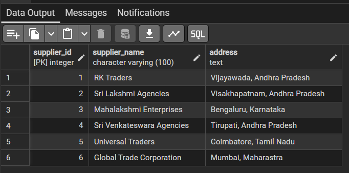

# Supplier Entry Module

## Module Description

The Supplier Entry Module is a master data management component developed to maintain supplier information in a structured manner. It provides a simple, responsive, and professional user interface for entering supplier details and stores the data permanently in a PostgreSQL database through REST APIs.

The application is built using **React.js** for the frontend, **FastAPI** for the backend, **SQLAlchemy** as the ORM, and **PostgreSQL** as the database.

---

## Features Implemented

### Frontend Features

- Professional React User Interface
- Clean and Responsive Layout
- Supplier Name Input
- Address Input
- Required Field Validation
- Loading Indicator while Saving
- Success Message after Save
- Error Message Handling
- Axios API Integration

---

### Backend Features

- FastAPI REST APIs
- POST API for Saving Supplier Details
- GET API for Retrieving Supplier Details
- SQLAlchemy ORM Integration
- PostgreSQL Database Integration
- Duplicate Supplier Validation
- Case-Insensitive Duplicate Checking
- Automatic Input Formatting
- CORS Configuration

---

### Database Features

- PostgreSQL Database
- supplier_master Table
- Auto Increment Supplier ID
- Permanent Data Storage
- UNIQUE Supplier Name Validation
- Ordered Supplier Retrieval

---

## Technology Stack

### Frontend

- React.js
- JavaScript
- HTML5
- CSS3
- Axios

### Backend

- FastAPI
- Python
- SQLAlchemy
- Uvicorn

### Database

- PostgreSQL
- pgAdmin 4

---

## Project Structure

```text

Supplier_Entry_Srijoshna
│
├── backend
│   └── main.py
│
├── frontend
│   ├── public
│   ├── src
│   ├── package.json
│   └── package-lock.json
│
├── README.md
└── .gitignore

```

---

## API Endpoints

### Save Supplier

**POST** `/supplier`

#### Sample Request

```json
{
  "supplier_name": "RK Traders",
  "address": "Vijayawada, Andhra Pradesh"
}
```

#### Success Response

```json
{
  "status": "success",
  "message": "Supplier saved successfully",
  "data": {
    "supplier_id": 1,
    "supplier_name": "RK Traders",
    "address": "Vijayawada, Andhra Pradesh"
  }
}
```

---

### Get Suppliers

**GET** `/supplier`

#### Sample Response

```json
[
  {
    "supplier_id": 1,
    "supplier_name": "RK Traders",
    "address": "Vijayawada, Andhra Pradesh"
  }
]
```

---

## Validation Rules

- Supplier Name is mandatory
- Address is mandatory
- Empty submissions are not allowed
- Duplicate supplier names are not allowed
- Duplicate checking is case-insensitive
- Leading and trailing spaces are removed automatically
- Supplier Name and Address are formatted before saving

---

## Database Table

### Table Name

```postgresql
supplier_master
```

### Columns

| Column | Type | Description |
| --- | --- | --- |
| supplier_id | Integer | Primary Key (Auto Increment) |
| supplier_name | VARCHAR(100) | Unique Supplier Name |
| address | TEXT | Supplier Address |

---

## Testing Status

- React UI Tested
- Form Validation Tested
- FastAPI APIs Tested
- Axios Integration Tested
- PostgreSQL Connection Tested
- SQLAlchemy ORM Tested
- Supplier Data Storage Verified
- Duplicate Validation Tested
- GET API Tested
- POST API Tested
- End-to-End Testing Completed

---

## Module Workflow

1. User enters Supplier Name and Address.
2. React validates the input fields.
3. Axios sends the data to the FastAPI backend.
4. FastAPI checks for duplicate supplier names.
5. Valid data is stored in PostgreSQL using SQLAlchemy.
6. Success or error response is returned to the frontend.
7. Supplier records can be retrieved through the GET API.

---

## Assigned Task

**Module:** Supplier Entry

**Role:** Frontend Development, Backend API Integration, and Database Integration

**Status:** Completed and Ready for Integration

---

## Screenshots

### Supplier Entry Form


---

### Form Validation


---

### Successful Save Operation


---

### PostgreSQL Database



---

### Swagger API Documentation


---

## Author

Srijoshna

Frontend Development • FastAPI API Integration • PostgreSQL Database Integration
