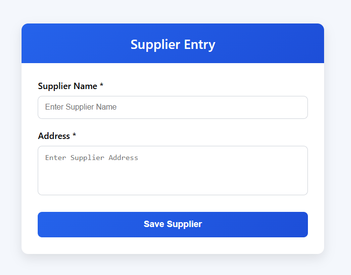
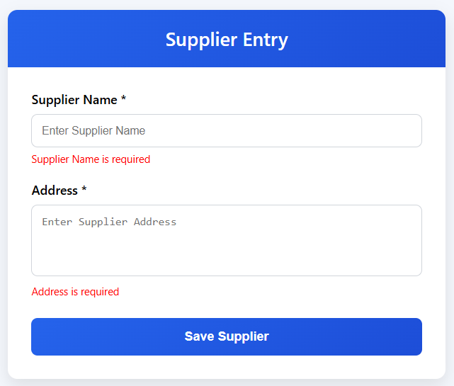
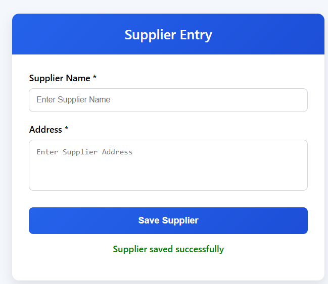
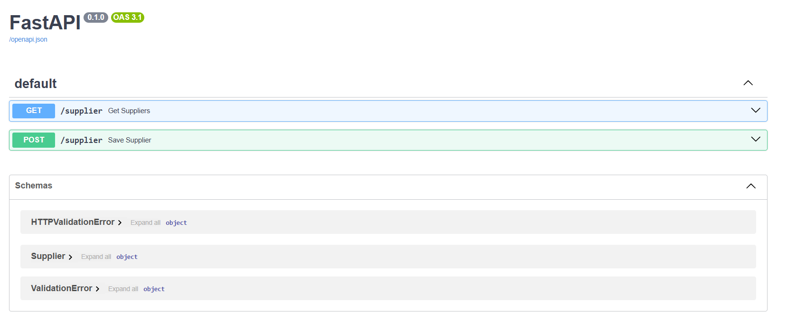

# Supplier Entry Module

## Module Description

The Supplier Entry Module is designed to manage supplier information through a simple and user-friendly interface. This module allows users to enter supplier details and save them using REST APIs.

The application is developed using **React.js** for the frontend and **FastAPI** for the backend.

---

## Features Implemented

### Frontend

- Professional React User Interface
- Supplier Name Entry
- Address Entry
- Form Validation
- Success and Error Messages
- Responsive Layout

### Backend Features

- FastAPI REST API
- POST API for Saving Supplier Details
- GET API for Retrieving Supplier Details
- CORS Configuration for Frontend Integration

### Integration

- Axios Integration
- Frontend and Backend Communication
- API Testing Completed

---

## Technology Stack

### Frontend (Tech Stack)

- React.js
- JavaScript
- HTML
- CSS
- Axios

### Backend

- FastAPI
- Python
- Uvicorn

---

## Project Structure

```text
Supplier_Entry_Srijoshna
│
├── backend
│   └── main.py
│
├── frontend
│   ├── public
│   ├── src
│   ├── package.json
│   └── package-lock.json
│
├── README.md
└── .gitignore
```

---

## API Endpoints

### Save Supplier

**POST** `/supplier`

Sample Request

```json
{
  "supplier_name": "RK Traders",
  "address": "Vijayawada"
}
```

---

### Get Suppliers

**GET** `/supplier`

Sample Response

```json
[
  {
    "supplier_name": "RK Traders",
    "address": "Vijayawada"
  }
]
```

---

## Validation Rules

- Supplier Name is required
- Address is required
- Empty submissions are not allowed

---

## Testing Status

- UI Testing Completed
- Form Validation Tested
- API Integration Tested
- POST API Tested
- GET API Tested
- End-to-End Testing Completed

---

## Assigned Task

**Module:** Supplier Entry

**Status:** Completed and Ready for Integration

---

## Screenshots

### Supplier Entry Form



---

### Form Validation



---

### Successful Save Operation



---

### API Documentation



## Author

Srijoshna
